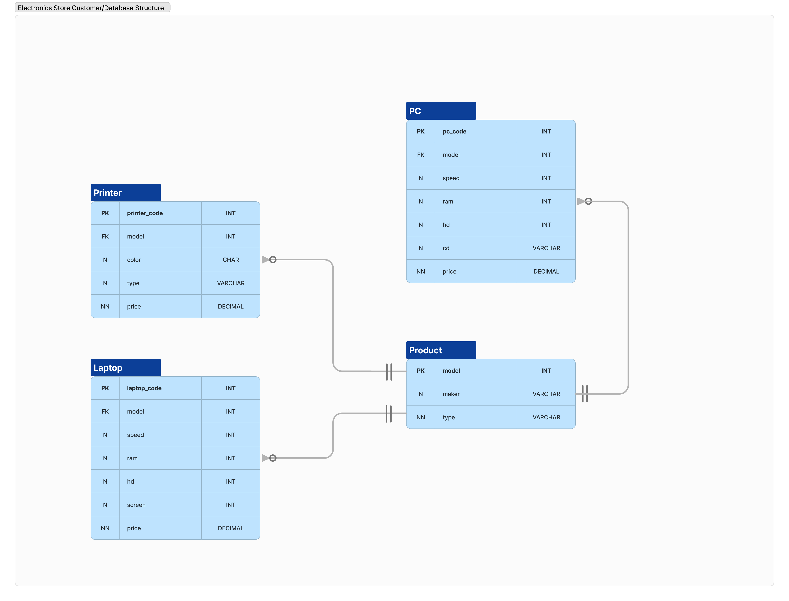

# Electronics Store Customer Database Project

## Description
As a customer of an electronics store, this project aims to utilize the store's interface to acquire information about the most functional and affordable devices that match specific requirements and preferences.
This project is part of the **Databases with SQL and Python** course on the [Hyperskill platform](https://hyperskill.org).

## Database Schema

Below is a visual representation of the database structure used in this project. The schema consists of the Product, PC, Laptop, and Printer tables, each storing relevant data for the electronics store:



- The **Product** table contains general information about all products, including printers, PCs, and laptops.
- The **Product** table is in a **one-to-many** relationship with the **Printer**, **PC**, and **Laptop** tables: one product can have multiple related printers/PCs/laptops, but each printer/PC/laptop corresponds to exactly one product.
- Each printer in the **Printer** table must have a corresponding entry in the **Product** table (mandatory), but not every product needs to be a printer (optional). The same holds true for the **PC** and **Laptop** tables.

## Database Explanation
The project includes a Market database with several tables:

- **Product Table:** Stores information about manufacturers (`maker`), model numbers (`model`), and product types (`type`).
  
- **PC Table:** Contains information about personal computers identified by a unique code (`pc_code`).

- **Laptop Table:** Similar to the PC table, but includes screen size (`screen`).

- **Printer Table:** Provides information about printer models, including whether they are color or black.

## SQL Queries

### Overview
The following SQL files contain queries that analyze the database and provide insights based on various criteria:

- [stage_1_find_fastest_pcs.sql](./stage_1_find_fastest_pcs.sql)
- [stage_2_average_price_inkjet_printers.sql](./stage_2_average_price_inkjet_printers.sql)
- [stage_3_total_price_laptops_by_maker.sql](./stage_3_total_price_laptops_by_maker.sql)
- [stage_4_makers_producing_both_pcs_and_laptops.sql](./stage_4_makers_producing_both_pcs_and_laptops.sql)
- [stage_5_laptops_higher_than_most_expensive_pcs.sql](./stage_5_laptops_higher_than_most_expensive_pcs.sql)
- [stage_6_second_most_cost_effective_pcs.sql](./stage_6_second_most_cost_effective_pcs.sql)

### Example Queries
Below are a few key queries to illustrate the type of analysis performed:

#### Stage 1: Identify PCs with 16 GB or More RAM
```sql
SELECT 
    pc_code, model, speed, ram
FROM 
    PC
WHERE 
    ram >= 16
ORDER BY 
    ram, speed DESC;
```
The query retrieves PCs with 16 GB of RAM or more.
The results are sorted first by ram in ascending order, then by speed in descending order.
The selected columns are pc_code, model, speed, and ram to ensure the correct column order.
